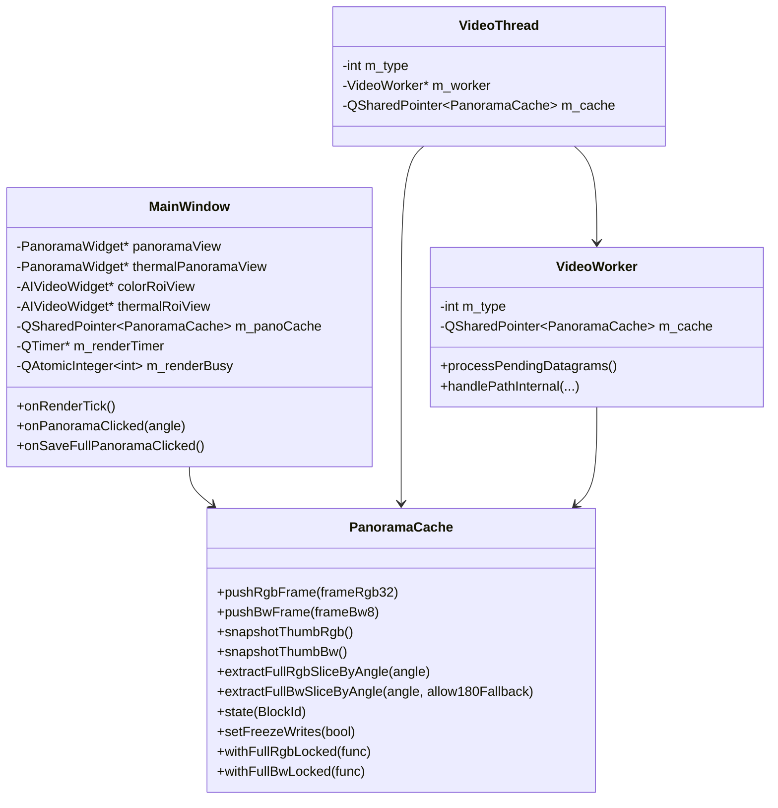
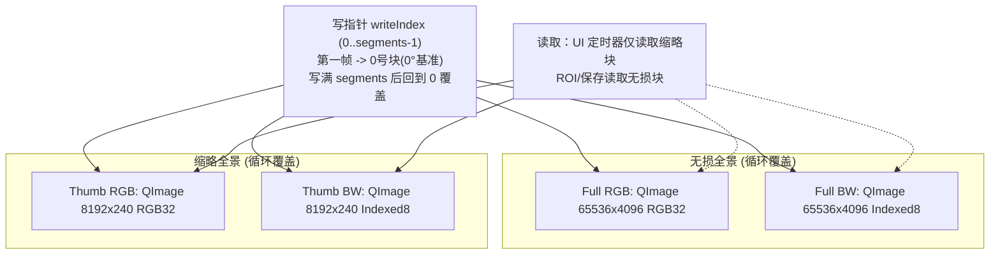

# 全景图缓存机制（重构版）

## 类图

## 内存布局图

## 接口说明

- 写入（子线程）
  - `pushRgbFrame(QImage frameRgb32)`：以第一帧为 0°，后续按到达顺序写入，写满回绕覆盖；同时更新缩略图块
  - `pushBwFrame(QImage frameBw8)`：同上（Indexed8 灰度）
- 读取（主线程）
  - `snapshotThumbRgb()/snapshotThumbBw()`：返回缩略图快照（用于 UI 刷新）
  - `extractFullRgbSliceByAngle(angle)`：按角度在无损全景中取一个 slice（ROI 来源）
  - `extractFullBwSliceByAngle(angle, allow180Fallback)`：BW 取 slice（可选 180° 兜底）
- 状态
  - `state(BlockId)`：写指针、有效帧数、是否写满一圈、丢帧计数等
- 保存
  - `saveFullPanoramaBmp(rgbPath, bwPath, err)`：分段读锁写盘，写入期间不停止转台与UI刷新（不同分段可能存在微小时间差）
